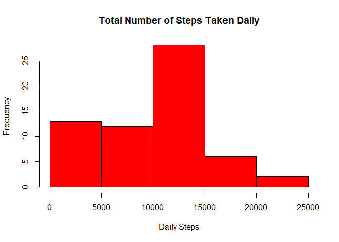
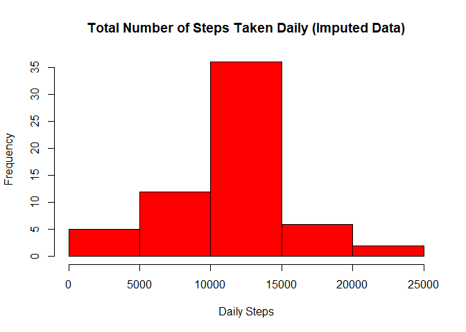
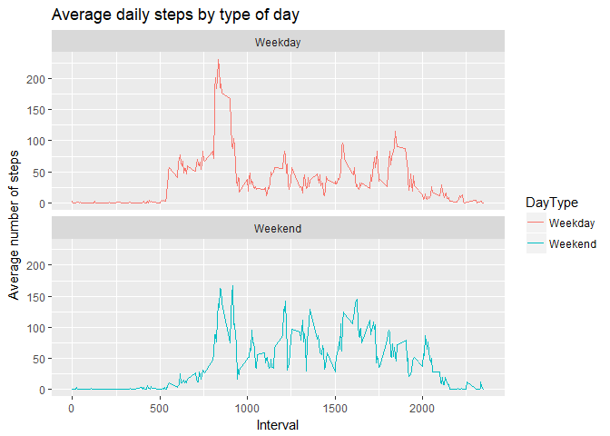

## Introduction

This a Markdown Document that describes the procedure conducted to answer the questions given.

### Loading and preprocessing the data
The following code check if the Activity Data is present on the current working directory. If not, it will download the file from [here](https://d396qusza40orc.cloudfront.net/repdata%2Fdata%2Factivity.zip). 


```r
activityDataFile <- paste0(getwd(),"/activity.csv")

if(!(file.exists(activityDataFile))){
  fileUrl <- "https://d396qusza40orc.cloudfront.net/repdata%2Fdata%2Factivity.zip"
  tempZipFile <- paste0(getwd(), "/temp.zip")
    
  if (Sys.info()['sysname'] == "Windows"){
    download.file(fileUrl, tempZipFile)
  } else {
    download.file(fileUrl, tempZipFile, method = "curl")
  }
    
  unzip(tempZipFile)
  
  file.remove(tempZipFile)
}

activityData <- read.csv(activityDataFile)
activityData$date <- as.POSIXct(activityData$date, "%Y-%m-%d", tz="")

summary(activityData)
```

```
##      steps             date               interval     
##  Min.   :  0.00   Min.   :2012-10-01   Min.   :   0.0  
##  1st Qu.:  0.00   1st Qu.:2012-10-16   1st Qu.: 588.8  
##  Median :  0.00   Median :2012-10-31   Median :1177.5  
##  Mean   : 37.38   Mean   :2012-10-31   Mean   :1177.5  
##  3rd Qu.: 12.00   3rd Qu.:2012-11-15   3rd Qu.:1766.2  
##  Max.   :806.00   Max.   :2012-11-30   Max.   :2355.0  
##  NA's   :2304
```

### What is mean total number of steps taken per day?

```r
daily_steps<- aggregate(activityData$steps, by = list(activityData$date), FUN = sum, na.rm = TRUE)
names(daily_steps) <- c("date", "steps")

steps_mean <- format(mean(daily_steps$steps), digits = 2, nsmall = 2, big.mark = ',')
steps_median <- format(median(daily_steps$steps), digits = 2, nsmall = 2, big.mark = ',')

hist(daily_steps$steps, main = "Total Number of Steps Taken Daily", xlab = "Daily Steps", col = "Red")
```

<!-- -->

The **mean** and **median** total number of steps taken per day are **9,354.23** and **10,395** respectively.

### What is the average daily activity pattern?

```r
average_daily_steps <- aggregate(activityData$steps, by=list(activityData$interval), FUN=mean, na.rm=TRUE)
names(average_daily_steps) <- c("interval", "mean")

steps_max <- average_daily_steps[which.max(average_daily_steps$mean), ]$interval

plot(average_daily_steps$interval, average_daily_steps$mean, type = "l", xlab="Interval", ylab="Average number of steps", main="Average number of steps per intervals")
```

<!-- -->

The **835th** of the 5-minute interval has the maximum average number of steps.

### Imputing missing values

```r
noNA <- format(sum(is.na(activityData$steps)), digits = 2, nsmall = 2, big.mark = ',')
```

There are **2,304** missing values in the dataset.   

Replacing the **NA** values with **Mean of the 5-min Interval** computed above and stored in **average_daily_steps**.

```r
activityData_Imputed <- transform(activityData, steps = ifelse(is.na(activityData$steps), average_daily_steps$mean[match(activityData$interval,average_daily_steps$interval)], activityData$steps))
```

Now, generate Histogram for the total number of steps taken each day and Calculate its Mean and Median.

```r
totalDailySteps_Imputed <- aggregate(activityData_Imputed$steps, by = list(activityData_Imputed$date), FUN = sum)
names(totalDailySteps_Imputed) <- c("date", "steps")

stepsImpute_mean <- format(mean(totalDailySteps_Imputed$steps), digits = 2, nsmall = 2, big.mark = ',')
stepsImpute_median <- format(median(totalDailySteps_Imputed$steps), digits = 2, nsmall = 2, big.mark = ',')

hist(totalDailySteps_Imputed$steps, xlab="Daily Steps", main="Total Number of Steps Taken Daily (Imputed Data)", col = "Red")
```

<!-- -->

The Mean and Median of the Activity Data with imputed missing values are **10,766.19** and **10,766.19**. These values are different from the values with missing data.    
In effect, filling out the missing values smooths out the Histogram and move the mean from **9,354.23** to **10,766.19**.

### Are there differences in activity patterns between weekdays and weekends?
Identifying the Weekday and Weekend, then Plot the Graph

```r
 activityData_Imputed$DayType <- ifelse(weekdays(activityData_Imputed$date) == "Saturday" | weekdays(activityData_Imputed$date) == "Sunday", "Weekend", "Weekday") 

Mean_ActivityData_Imputed <- aggregate(activityData_Imputed$steps, by = list(activityData_Imputed$interval, activityData_Imputed$DayType), FUN = mean)
names(Mean_ActivityData_Imputed) <- c("Interval", "DayType", "MeanSteps")

plot<- ggplot(Mean_ActivityData_Imputed, aes(x = Interval , y = MeanSteps, color = DayType)) +
       geom_line() +
       labs(title = "Average daily steps by type of day", x = "Interval", y = "Average number of steps") +
       facet_wrap(~DayType, ncol = 1, nrow=2)
print(plot)
```

<!-- -->
